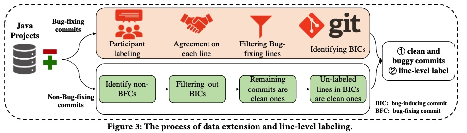

# JIT-Fine-replication-package


This repository contains source code that we used to perform experiment in paper titled "The Best of Both Worlds: Integrating Semantic Features with Expert Features for Defect Prediction and Localization".


Please follow the steps below to reproduce the result

## Dataset

- We build a large-scale pure line-level labeled dataset **JIT-Defect4J** for JIT-DP research on the basic of [LLTC4J](https://arxiv.org/abs/2011.06244), which is originally collected by Herbold et al. Besides, we also build the line-level defect-introducing datasets for the study of JIT-DL.
- LLTC4J is good starting-point of collecting high-quality, fine-grained, comprehensive dataset for just-in-time defect predictionand line-level localization research. However, as aforementioned, it only collects the bug-fixing commits and label the lines only in each bug-fixing commit. Therefore, we extend this dataset from two-sides: 1) extracting both clean commits and buggy commits; 2) extracting the line label in defect-introducing commits.


## Environment Setup

### Python Environment Setup

Run the following command in terminal (or command line) to prepare virtual environment

```shell
conda env create --file requirements.yml
conda activate jitfine
```

### R Environment Setup

Download the following package: `tidyverse`, `gridExtra`, `ModelMetrics`, `caret`, `reshape2`, `pROC`, `effsize`, `ScottKnottESD`

## Experiment Result Replication Guide

Before the replication, you need to unzip `data.zip` file firstly.

### **RQ1 Baseline Implementation**

There are 4 baselines in RQ1(i.e., `LApredict`, `Deeper`, `DeepJIT`, `CC2Vec`, and `JITLine`). To reproduce the results of baselines, run the following commands:

- LApredict

  ```shell
  python -m baselines.LApredict.lapredict
  ```

- Deeper

  ```shell
  python -m baselines.Deeper.deeper
  ```

- DeepJIT

  ```shell
  python -m baselines.DeepJIT.deepjit
  ```

- CC2Vec

  ```shell
  python -m baselines.CC2Vec.cc2vec
  ```

- JITLine

  ```shell
  refer to RQ2
  ```

### **RQ2 Baseline Implementation**

JITLine has three ablation experiments:(i.e., `only expert feature`, `only semantic feature` and `combination`). 

- only expert feature experiment

  ```shell
  python -m baselines.JITLine.jitline_rq2 -style manual
  ```

- only semantic feature experiment

  ```shell
  python -m baselines.JITLine.jitline_rq2 -style semantic
  ```

- combination

  ```shell
  python -m baselines.JITLine.jitline_rq2 -style concat
  ```

### **RQ3 Baseline Implementation**

There are 2 baselines in RQ1(i.e., `JITLine` and `ngram`). 

- ngram

  First, run code in `n_gram.java` and then run the following command:

  ```shell
  python -m baselines.ngram.evaluate_result
  ```

- JITLine

  ```shell
  python -m baselines.JITLine.jitline_rq3 -style concat
  ```

### **JIT-Fine Implementation**

To train JIT-Fine, run the following command:

```shell
python -m JITFine.concat.run \
    --output_dir=model/jitfine/saved_models_concat/checkpoints \
    --config_name=microsoft/codebert-base \
    --model_name_or_path=microsoft/codebert-base \
    --tokenizer_name=microsoft/codebert-base \
    --do_train \
    --train_data_file data/jitfine/changes_train.pkl data/jitfine/features_train.pkl \
    --eval_data_file data/jitfine/changes_valid.pkl data/jitfine/features_valid.pkl\
    --test_data_file data/jitfine/changes_test.pkl data/jitfine/features_test.pkl\
    --epoch 50 \
    --max_seq_length 512 \
    --max_msg_length 64 \
    --train_batch_size 24 \
    --eval_batch_size 128 \
    --learning_rate 1e-5 \
    --max_grad_norm 1.0 \
    --evaluate_during_training \
    --feature_size 14 \
    --patience 10 \
    --seed 42 2>&1| tee model/jitfine/saved_models_concat/train.log

```

To obtain the evaluation, run the following command:

```shell
python -m JITFine.concat.run \
    --output_dir=model/jitfine/saved_models_concat/checkpoints \
    --config_name=microsoft/codebert-base \
    --model_name_or_path=microsoft/codebert-base \
    --tokenizer_name=microsoft/codebert-base \
    --do_test \
    --train_data_file data/jitfine/changes_train.pkl data/jitfine/features_train.pkl \
    --eval_data_file data/jitfine/changes_valid.pkl data/jitfine/features_valid.pkl\
    --test_data_file data/jitfine/changes_test.pkl data/jitfine/features_test.pkl\
    --epoch 50 \
    --max_seq_length 512 \
    --max_msg_length 64 \
    --train_batch_size 256 \
    --eval_batch_size 25 \
    --learning_rate 2e-5 \
    --max_grad_norm 1.0 \
    --evaluate_during_training \
    --only_adds \
    --buggy_line_filepath=data/jitfine/changes_complete_buggy_line_level.pkl \
    --seed 42 2>&1 | tee model/jitfine/saved_models_concat/test.log

```

### Ablation Experiment

To train JIT-Fine using only expert feature, run the following command:

```shell
python -m JITFine.artificial.run \
    --output_dir=model/jitfine/saved_models_artificial/checkpoints\
    --config_name=microsoft/codebert-base \
    --model_name_or_path=microsoft/codebert-base \
    --tokenizer_name=microsoft/codebert-base \
    --do_train \
    --train_data_file data/jitfine/changes_train.pkl data/jitfine/features_train.pkl \
    --eval_data_file data/jitfine/changes_valid.pkl data/jitfine/features_valid.pkl\
    --test_data_file data/jitfine/changes_test.pkl data/jitfine/features_test.pkl\
    --epoch 50 \
    --max_seq_length 512 \
    --max_msg_length 64 \
    --train_batch_size 32 \
    --eval_batch_size 32 \
    --learning_rate 2e-5 \
    --max_grad_norm 1.0 \
    --evaluate_during_training \
    --patience 10 \
    --seed 42 2>&1| tee model/jitfine/saved_models_artificial/train.log
```

To obtain the evaluation, run the following command:

```shell
python -m JITFine.artificial.run \
    --output_dir=model/jitfine/saved_models_artificial/checkpoints\
    --config_name=microsoft/codebert-base \
    --model_name_or_path=microsoft/codebert-base \
    --tokenizer_name=microsoft/codebert-base \
    --do_test \
   --train_data_file data/jitfine/changes_train.pkl data/jitfine/features_train.pkl \
    --eval_data_file data/jitfine/changes_valid.pkl data/jitfine/features_valid.pkl\
    --test_data_file data/jitfine/changes_test.pkl data/jitfine/features_test.pkl\
    --epoch 50 \
    --max_seq_length 512 \
    --train_batch_size 24 \
    --eval_batch_size 128 \
    --learning_rate 2e-5 \
    --max_grad_norm 1.0 \
    --evaluate_during_training \
    --seed 42 2>&1 | tee model/jitfine/saved_models_artificial/test.log
```

To train JIT-Fine using only semantic feature, run the following command:

```shell
python -m JITFine.semantic.run \
    --output_dir=model/jitfine/saved_models_semantic/checkpoints \
    --config_name=microsoft/codebert-base \
    --model_name_or_path=microsoft/codebert-base \
    --tokenizer_name=microsoft/codebert-base \
    --do_train \
    --train_data_file data/jitfine/changes_train.pkl data/jitfine/features_train.pkl \
    --eval_data_file data/jitfine/changes_valid.pkl data/jitfine/features_valid.pkl\
    --test_data_file data/jitfine/changes_test.pkl data/jitfine/features_test.pkl\
    --epoch 50 \
    --max_seq_length 512 \
    --max_msg_length 64 \
    --train_batch_size 24 \
    --eval_batch_size 32 \
    --learning_rate 2e-5 \
    --max_grad_norm 1.0 \
    --evaluate_during_training \
    --patience 10 \
    --seed 42 2>&1| tee model/jitfine/saved_models_semantic/train.log
```

To obtain the evaluation, run the following command:

```shell
python -m JITFine.semantic.run \
    --output_dir=model/jitfine/saved_models_semantic/checkpoints \
    --config_name=microsoft/codebert-base \
    --model_name_or_path=microsoft/codebert-base \
    --tokenizer_name=microsoft/codebert-base \
    --do_test \
    --train_data_file data/jitfine/changes_train.pkl data/jitfine/features_train.pkl \
    --eval_data_file data/jitfine/changes_valid.pkl data/jitfine/features_valid.pkl\
    --test_data_file data/jitfine/changes_test.pkl data/jitfine/features_test.pkl\
    --epoch 50 \
    --max_seq_length 512 \
    --max_msg_length 64 \
    --train_batch_size 24 \
    --eval_batch_size 100 \
    --learning_rate 2e-5 \
    --max_grad_norm 1.0 \
    --patience 10 \
    --seed 42 2>&1|  tee model/jitfine/saved_models_semantic/test.log
```

